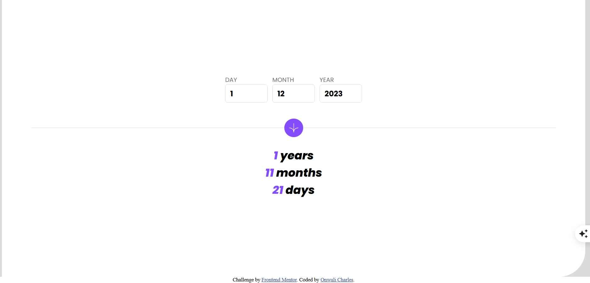

# Frontend Mentor - Age calculator app solution

This is a solution to the [Age calculator app challenge on Frontend Mentor](https://www.frontendmentor.io/challenges/age-calculator-app-dF9DFFpj-Q). Frontend Mentor challenges help you improve your coding skills by building realistic projects. 

## Table of contents

- [Overview](#overview)
  - [The challenge](#the-challenge)
  - [Screenshot](#screenshot)
  - [Links](#links)
- [My process](#my-process)
  - [Built with](#built-with)
  - [What I learned](#what-i-learned)
  - [Continued development](#continued-development)
- [Author](#author)

## Overview

### The challenge

Users should be able to:

- View an age in years, months, and days after submitting a valid date through the form
- Receive validation errors if:
  - Any field is empty when the form is submitted
  - The day number is not between 1-31
  - The month number is not between 1-12
  - The year is in the future
  - The date is invalid e.g. 31/04/1991 (there are 30 days in April)
- View the optimal layout for the interface depending on their device's screen size
- See hover and focus states for all interactive elements on the page
- **Bonus**: See the age numbers animate to their final number when the form is submitted

### Screenshot

### Links

- Solution URL: [https://github.com/Ot-Charlie/age-calculator]
- Live Site URL: [https://ot-charlie.github.io/age-calculator/]

## My process

### Built with

- Semantic HTML5 markup
- CSS custom properties
- Flexbox
- Javascript
- Mobile-first workflow

### What I learned
This challenge helped me to understand date validation in Javascript. 
By using Javascript logic in validating users input against the current date and ensuring all date components (day, month, year) are correct.

### Continued development
I hope I can continue building and getting better at replicating pixel perfect designs as well as improving my javascript logic abilities.

**Note: Delete this note and the content within this section and replace with your own plans for continued development.**

## Author

- Website -(https://onwuli-charles.netlify.app)
- Frontend Mentor - (https://www.frontendmentor.io/profile/ot.charlie)
- Twitter - (https://www.twitter.com/@kingcharlie01)

